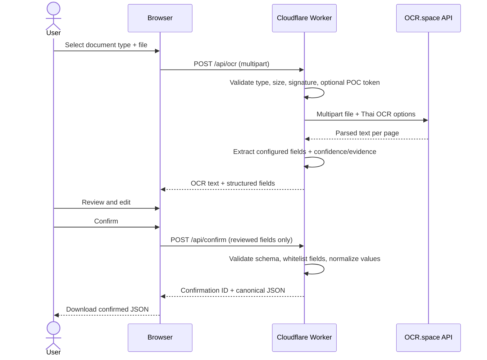

# OCR document-intake POC flow

## Goal

Prove the user flow for a known document type:

1. User selects the document type.
2. User uploads a PDF, JPG, or PNG.
3. The Cloudflare Worker validates the file and keeps the OCR API key server-side.
4. The Worker sends the file to OCR.space using Thai OCR.
5. Deterministic extraction maps the OCR text into the configured fields.
6. The browser prefills editable inputs and shows confidence, source, and evidence.
7. The user reviews and confirms the values.
8. The browser posts only the reviewed fields to `/api/confirm`.
9. The Worker validates and canonicalizes those fields against the selected schema.
10. The POC returns/downloads a JSON object. It does **not** save the file or data.

## Trust boundaries

- `OCR_SPACE_API_KEY` is a Worker secret and is never returned to the browser.
- `OCR_POC_ACCESS_TOKEN` is optional but recommended for a public deployment to reduce anonymous quota abuse.
- Documents are sent to an external OCR provider. Do not use confidential documents without approval.
- The POC intentionally has no R2/D1 persistence. `/api/confirm` validates and echoes canonical data only.
- The attached test PDF is not committed to this public repository.

## Current schema

`progress_update_letter` contains:

- document number
- document date
- subject
- recipient
- references
- attachments
- sender organization
- signer name
- signer position
- main details

The user must select the schema before upload. The POC does not auto-classify document type.

## Integration target

When moving this flow into the main dashboard:

- keep OCR/API calls behind authenticated server routes;
- upload the original file to private R2 only after the dashboard's upload policy passes;
- keep AI/OCR values as a draft;
- write metadata to D1 only after explicit user confirmation;
- record source, confidence, reviewer, and revision history for every confirmed field.
